<div align="center">

# 🤟 IndiSignLang — Indian Sign Language (ISL) Recognition Using CNN

**PRAICP-1000 · Artificial Intelligence Capstone Project**

*Classifying static Indian Sign Language hand signs (24 letter classes) from a single photograph using a tuned Convolutional Neural Network.*


</div>

---

## 📑 Table of Contents

1. [Project Overview](#-project-overview)
2. [Key Highlights](#-key-highlights)
3. [Project Details](#-project-details)
4. [Dataset](#-dataset)
5. [Pipeline Architecture](#-pipeline-architecture)
6. [Image Preprocessing](#-image-preprocessing)
7. [Data Augmentation](#-data-augmentation)
8. [Model Architecture](#-model-architecture)
9. [Hyperparameter Tuning](#-hyperparameter-tuning)
10. [Results](#-results)
11. [Critical Note on the Results](#-critical-note-on-the-results)
12. [Installation & Usage](#-installation--usage)
13. [Predicting a New Image](#-predicting-a-new-image)
14. [Repository Structure](#-repository-structure)
15. [Challenges & How They Were Solved](#-challenges--how-they-were-solved)
16. [Business Insights](#-business-insights)
17. [Limitations](#-limitations)
18. [Future Work](#-future-work)
19. [Project Links](#-project-links)
20. [Author](#-author)

---

## 🎯 Project Overview

Sign language is the primary mode of communication for many people who are deaf or hard of hearing, yet most people do not understand it. This creates a communication barrier in education, healthcare, public services and daily life.

This project builds a **CNN-based image classifier** that looks at a photograph of a hand sign from the Indian Sign Language dataset and predicts which sign it represents. It covers both goals set by the DataMites project brief:

| # | Goal | How it is addressed |
|---|------|---------------------|
| 1 | **Image preprocessing** | Resize every image to 128×128 RGB, normalise pixel values to [0, 1], augment during training |
| 2 | **ML model to predict the sign** | Baseline CNN → Keras Tuner random search → tuned final CNN, evaluated with a full metric suite |

---

## ✨ Key Highlights

- 🧹 **Full data audit** – corrupt-file check, resolution/orientation analysis, class-balance analysis
- ⚖️ **Imbalance handling** – stratified 70/15/15 split + balanced class weights + macro-averaged metrics
- 🔄 **Augmentation inside the model** – rotation, translation and zoom (flip deliberately excluded)
- 🧪 **Baseline vs tuned comparison** – fair, validation-based model selection (test set never used to choose)
- 🔍 **Deep evaluation** – classification report, confusion matrix, per-sign F1, misclassified-image gallery
- 🔮 **End-to-end inference** – `predict_sign()` returns the top-3 signs with confidence
- 💾 **Deployable artefacts** – model saved as `.keras` + class-name JSON, with a reload-and-verify check
- ♻️ **Reproducible** – fixed seeds, configurable run size (`MAX_IMAGES_PER_CLASS`, `TUNER_TRIALS`, `TUNER_EPOCHS`)

---

## 📋 Project Details

| Field | Value |
|-------|-------|
| **Project Title** | PRAICP-1000: IndiSignLang – Indian Sign Language Recognition |
| **Project Code** | PRAICP-1000 |
| **Team Code** | PTID-AIE-JUL-26-11142 |
| **Project Type** | Artificial Intelligence Capstone Project |
| **Dataset Source** | DataMites Capstone Project Dataset |
| **Submitted By** | Sameeksha |

---

## 🗂 Dataset

**Name:** IndiSignLang — one directory per sign; the directory name is the class label.

**Download:** [PRAICP-1000-IndiSignLang.zip](https://d3ilbtxij3aepc.cloudfront.net/projects/AI-Capstone-Projects/PRAICP-1000-IndiSignLang.zip) *(downloaded and extracted automatically by the notebook)*

### Dataset facts

| Property | Value |
|----------|-------|
| Total images | **4,972** |
| Classes | **24** — letters `A–Y` excluding `J` and `Z` |
| File format / colour mode | JPEG / RGB |
| Corrupt files | None found |
| Smallest class | `H` — 116 images |
| Largest class | `B` — 259 images |
| Imbalance ratio | ≈ **2.2 : 1** (moderate) |

> **Why no J and Z?** These letters are normally signed with a hand *motion*, which cannot be captured in a single still image.

### Original image resolutions

| Resolution | Orientation | Images |
|-----------|-------------|-------:|
| 640 × 480 | Landscape | 3,963 |
| 1920 × 1088 | Landscape | 830 |
| 1088 × 1920 | Portrait | 179 |

### Domain notes

- Each image shows **one hand on a plain, light background** forming one static sign.
- Meaning is carried by **hand shape** (which fingers are extended/curled/crossed, thumb placement, palm orientation) — a natural fit for CNNs.
- Within-class variation exists in hand size, skin tone, camera angle, position in frame and sharpness (some motion blur).
- Some signs (closed-fist / curled-finger shapes) are visually very similar and are expected to be the hardest to separate.

---

## 🏗 Pipeline Architecture

```mermaid
flowchart LR
    A[Download & extract ZIP] --> B[Auto-detect class folders]
    B --> C[Data audit<br/>corrupt check · sizes · balance]
    C --> D[EDA]
    D --> E[Preprocess<br/>RGB · 128×128 · ÷255]
    E --> F[Stratified split<br/>70 / 15 / 15]
    F --> G[Class weights<br/>from train labels]
    G --> H[Baseline CNN]
    G --> I[Keras Tuner<br/>RandomSearch]
    I --> J[Final tuned CNN]
    H --> K[Model comparison<br/>on validation set]
    J --> K
    K --> L[Best model evaluation<br/>on unseen test set]
    L --> M[predict_sign&#40;&#41;]
    L --> N[Save .keras + class names]
```



---

## 🖼 Image Preprocessing

The same `preprocess_image()` function is used for **training and inference**, guaranteeing identical treatment of new images.

| Step | Detail | Why |
|------|--------|-----|
| **Convert to RGB** | Ensures 3 channels | Consistent input depth |
| **Resize to 128 × 128** | Lanczos resampling, `Image.draft()` for fast JPEG decode of large files | Fixed CNN input size; keeps finger detail while keeping training fast |
| **Normalise** | Divide by 255 → range [0, 1] | Faster, more stable gradient-based training |

Resulting tensor shape per image: `(128, 128, 3)`. Full dataset: `X.shape = (4972, 128, 128, 3)`.

> Resizing to a square slightly alters the aspect ratio of non-square photos. This is applied identically to all training and future images, so the CNN learns from the resized versions consistently.

---

## 🔄 Data Augmentation

Implemented with Keras preprocessing layers **at the start of the model**. They are active only during training and automatically disabled for validation, testing and prediction.

| Transformation | Range | Simulates |
|----------------|-------|-----------|
| `RandomRotation` | factor 0.04 (≈ ±14°) | Tilted hand |
| `RandomTranslation` | ±10 % height & width | Hand not centred |
| `RandomZoom` | ±10 % | Hand nearer/farther from camera |

> 🚫 **Horizontal flip is intentionally NOT used** — a mirrored hand turns a left hand into a right hand (or vice-versa) and may not be a valid example of the same sign.

---

## 🧠 Model Architecture

### Baseline CNN (3,307,736 parameters)

```
Input (128×128×3)
 └─ Data Augmentation (rotation · translation · zoom)
 └─ Conv2D(32, 3×3, ReLU)  → MaxPool(2×2)
 └─ Conv2D(64, 3×3, ReLU)  → MaxPool(2×2)
 └─ Conv2D(128, 3×3, ReLU) → MaxPool(2×2)
 └─ Flatten
 └─ Dense(128, ReLU) → Dropout(0.5)
 └─ Dense(24, Softmax)
```

### Final tuned CNN (6,522,200 parameters)

```
Input (128×128×3)
 └─ Data Augmentation
 └─ Conv2D(32, 3×3, ReLU)  → MaxPool(2×2)     ← tuned
 └─ Conv2D(64, 3×3, ReLU)  → MaxPool(2×2)     ← tuned
 └─ Conv2D(128, 3×3, ReLU) → MaxPool(2×2)
 └─ Flatten
 └─ Dense(256, ReLU) → Dropout(0.3)           ← tuned
 └─ Dense(24, Softmax)
```

### Training configuration

| Setting | Baseline | Final |
|---------|----------|-------|
| Optimiser | Adam (lr = 0.001) | Adam (lr = 0.001) |
| Loss | Sparse categorical cross-entropy | Sparse categorical cross-entropy |
| Max epochs | 30 | 40 |
| Batch size | 32 | 32 |
| Class weights | ✅ Balanced | ✅ Balanced |
| `EarlyStopping` | monitor `val_loss`, patience 5, restore best weights | patience 6, restore best weights |
| `ReduceLROnPlateau` | factor 0.5, patience 2, min lr 1e-6 | same |
| `ModelCheckpoint` | best `val_loss` | best `val_loss` |

---

## 🎛 Hyperparameter Tuning

**Method:** Keras Tuner `RandomSearch` — 8 trials, up to 15 epochs each, objective `val_accuracy`, seed 42.

### Search space (96 possible combinations)

| Hyperparameter | Values |
|----------------|--------|
| Filters — conv layer 1 | 32, 64 |
| Filters — conv layer 2 | 64, 128 |
| Dense units | 128, 256 |
| Dropout | 0.3, 0.4, 0.5 |
| Learning rate | 0.001, 0.0001 |
| Batch size | 16, 32 |

### Trial ranking

| Rank | Batch | Filters 1 | Filters 2 | Dense | Dropout | LR | Val Accuracy |
|:---:|:---:|:---:|:---:|:---:|:---:|:---:|:---:|
| 🥇 1 | 32 | 32 | 64 | 256 | 0.3 | 0.001 | **0.9960** |
| 2 | 32 | 32 | 128 | 128 | 0.4 | 0.001 | 0.9933 |
| 3 | 16 | 32 | 128 | 256 | 0.5 | 0.001 | 0.9906 |
| 4 | 16 | 32 | 128 | 128 | 0.4 | 0.001 | 0.9893 |
| 5 | 16 | 32 | 64 | 256 | 0.4 | 0.0001 | 0.9879 |
| 6 | 32 | 32 | 64 | 128 | 0.5 | 0.001 | 0.9705 |
| 7 | 16 | 32 | 128 | 128 | 0.4 | 0.0001 | 0.9638 |
| 8 | 32 | 32 | 64 | 128 | 0.5 | 0.0001 | 0.8968 |

⏱ Total search time on CPU (no GPU): **≈ 5 h 28 min**.

---

## 📊 Results

### Data split (stratified)

| Set | Images | Purpose |
|-----|-------:|---------|
| Training (70 %) | 3,480 | Learn weights |
| Validation (15 %) | 746 | Early stopping, tuning, model selection |
| Test (15 %) | 746 | Final unbiased estimate (used once) |

### Model comparison

| Model | Split | Accuracy | Precision (macro) | Recall (macro) | F1 (macro) |
|-------|-------|:-------:|:-------:|:-------:|:-------:|
| Baseline CNN | Validation | 0.9946 | 0.9944 | 0.9932 | 0.9937 |
| Baseline CNN | Test | 0.9933 | 0.9936 | 0.9921 | 0.9926 |
| **Final Tuned CNN** | Validation | **0.9987** | **0.9980** | **0.9978** | **0.9979** |
| **Final Tuned CNN** | Test | **1.0000** | **1.0000** | **1.0000** | **1.0000** |

**Selected model:** Final Tuned CNN (highest *validation* accuracy).
**Misclassified test images:** **0 / 746**.

Every one of the 24 signs achieved precision = recall = F1 = 1.00 on the test set.

---

## ⚠️ Critical Note on the Results

A perfect 100 % test score is excellent, but it should be read carefully rather than taken at face value:

- **Random image-level split.** Images were split randomly, not by person/session. If the dataset contains many near-identical shots of the same hand (very common in sign-language collections), near-duplicates can land in both train and test, which inflates scores.
- **Small test set.** 746 images means a handful of errors would have moved accuracy by only a few tenths of a percent; 0 errors does not prove the true error rate is 0.
- **Controlled data.** Plain backgrounds and a single hand are easier than real-world webcam conditions (clutter, lighting changes, different signers).

**How to validate more rigorously:** use a *signer-wise* (group) split, test on photos you capture yourself, and try cluttered backgrounds. Expect lower numbers in those settings — that is normal and more informative.

---

## 🚀 Installation & Usage

### Option A — Google Colab (easiest)

1. Open `PRAICP_1000_IndiSignLang.ipynb` in Colab.
2. *Runtime → Run all.* The dataset downloads automatically.

### Option B — Local

```bash
# 1. Clone
git clone https://github.com/Sameekshagithub/PRAICP-1000-Indian-Sign-Language-ISL-Recognition-Using-CNN.git
cd PRAICP-1000-Indian-Sign-Language-ISL-Recognition-Using-CNN

# 2. Create environment
python -m venv .venv
source .venv/bin/activate          # Windows: .venv\Scripts\activate

# 3. Install dependencies
pip install tensorflow keras-tuner numpy pandas matplotlib seaborn \
            scikit-learn pillow requests tqdm jupyter

# 4. Launch
jupyter notebook PRAICP_1000_IndiSignLang.ipynb
```

### Faster dry-run (low-resource machines)

Edit these constants in the notebook:

```python
MAX_IMAGES_PER_CLASS = 30   # use a small subset (None = full dataset)
TUNER_TRIALS = 2            # default 8
TUNER_EPOCHS = 3            # default 15
BASELINE_EPOCHS = 5         # default 30
FINAL_EPOCHS = 5            # default 40
```

> 💡 A GPU is strongly recommended. The full run used CPU only and took many hours, mostly in the tuning step.

---

## 🔮 Predicting a New Image

### Inside the notebook

```python
# Set a path to your own image, then re-run the cell
MY_IMAGE_PATH = "my_sign.jpg"
predict_sign(MY_IMAGE_PATH)
```

`predict_sign()` returns `(predicted_sign, confidence, top_3)` and plots the image alongside a top-3 confidence bar chart. On Colab, set `UPLOAD_OWN_IMAGE = True` for an upload button.

### Standalone script using the saved model

```python
import json
import numpy as np
import tensorflow as tf
from PIL import Image

model = tf.keras.models.load_model("IndiSignLang_CNN_Model.keras")
class_names = json.load(open("IndiSignLang_class_names.json"))

def predict(path, size=128):
    img = Image.open(path).convert("RGB").resize((size, size), Image.LANCZOS)
    x = np.asarray(img, dtype="float32")[None] / 255.0      # same preprocessing as training
    probs = model.predict(x, verbose=0)[0]
    top = np.argsort(probs)[::-1][:3]
    return [(class_names[i], float(probs[i])) for i in top]

print(predict("my_sign.jpg"))
```

> **Note:** confidence is the model's softmax probability — it is **not** a guarantee of correctness, and the model will always output *one of the 24 letters* even for images that contain no valid sign.

---

## 📁 Repository Structure

```
PRAICP-1000-Indian-Sign-Language-ISL-Recognition-Using-CNN/
├── PRAICP_1000_IndiSignLang.ipynb      # Complete end-to-end notebook
├── README.md                           # This file
├── IndiSignLang_CNN_Model.keras        # Saved best model (generated by notebook)
├── IndiSignLang_class_names.json       # Class-index → letter mapping (generated)
├── best_baseline_cnn.keras             # Baseline checkpoint (generated)
├── best_final_cnn.keras                # Final-model checkpoint (generated)
├── isl_tuning/                         # Keras Tuner trial logs (generated)
└── IndiSignLang_data/                  # Extracted dataset (generated, not committed)
```

> 💡 Add `IndiSignLang_data/`, `*.zip` and `isl_tuning/` to `.gitignore` to keep the repository light.

---

## 🧗 Challenges & How They Were Solved

| Challenge | Solution |
|-----------|----------|
| **Three different resolutions / orientations** | Unified 128×128 RGB resize; `Image.draft()` for fast decoding of 1920×1088 files |
| **Moderate class imbalance (2.2 : 1)** | Stratified splits, balanced class weights, macro-averaged metrics |
| **Visually similar signs** | Per-sign F1, confusion matrix and misclassified-image gallery rather than accuracy alone |
| **Overfitting on ~3.5k training images** | Augmentation, dropout, early stopping, learning-rate reduction |
| **Information leakage in model selection** | Hyperparameters and best model chosen on validation only; test used once |
| **Memory and compute limits** | 128×128 storage, full-size arrays freed after splitting, configurable trials/epochs/subset size |

---

## 💼 Business Insights

1. **Assistive communication tool** – A phone/web app built on this model could help non-signers understand sign-language users in schools, hospitals, banks and public offices.
2. **Preprocessing enables real-world use** – Standardising inputs lets one model handle photos from different cameras and orientations.
3. **Confusion analysis guides data collection** – Weak or confused signs identify exactly where to collect more varied photos.
4. **Tuning value is measurable** – The tuned model improved validation accuracy (0.9946 → 0.9987) and removed all test errors versus the baseline's 5 (≈ 0.67 % of 746).
5. **Scope matters** – This is a building block for *static letters*; production systems need words, sentences, two-handed signs and motion.

---

## 🚧 Limitations

- Recognises **static single-hand letter signs only** (no J, Z, words or sentences).
- Trained on a **controlled, plain-background** dataset; real-world robustness is unverified.
- **Random split** rather than signer-wise split (see [critical note](#-critical-note-on-the-results)).
- No out-of-distribution / "no sign" rejection class.
- Not validated with deaf or hard-of-hearing users — **should not be used in safety-critical or official communication settings** without such validation.

---

## 🔭 Future Work

- [ ] Signer-wise / group-based splitting and cross-validation
- [ ] **Transfer learning** (MobileNetV2, EfficientNet, ResNet) for stronger generalisation
- [ ] **Real-time webcam** recognition with MediaPipe hand-landmark detection
- [ ] Video / sequence models (CNN-LSTM, 3D-CNN, Transformers) for motion signs such as J and Z
- [ ] Extend to ISL **words and phrases**, and two-handed signs
- [ ] Add a "no sign / unknown" class and confidence thresholding
- [ ] Deploy as a **Streamlit / Gradio** web app or **TensorFlow Lite** mobile app
- [ ] Explainability with **Grad-CAM** to show which hand regions drive predictions
- [ ] Larger Keras Tuner search (more trials, Bayesian optimisation / Hyperband)

---

## 🔗 Project Links

| Resource | Link |
|----------|------|
| 💻 **GitHub Repository** | [Sameekshagithub/PRAICP-1000-Indian-Sign-Language-ISL-Recognition-Using-CNN](https://github.com/Sameekshagithub/PRAICP-1000-Indian-Sign-Language-ISL-Recognition-Using-CNN.git) |
| 📂 **Google Drive (PPT & Report)** | [Open folder](https://drive.google.com/drive/folders/1uiFsyNDpfCWIWidHgfDLZDjr36PixxGG?usp=drive_link) |
| 📦 **Dataset** | [PRAICP-1000-IndiSignLang.zip](https://d3ilbtxij3aepc.cloudfront.net/projects/AI-Capstone-Projects/PRAICP-1000-IndiSignLang.zip) |

---

## 👩‍💻 Author

**Sameeksha**
AI Capstone Project · Team Code `PTID-AIE-JUL-26-11142`

---

<div align="center">

⭐ If you found this project useful, consider giving the repository a star!

*Built to improve communication accessibility with AI.*

</div>
